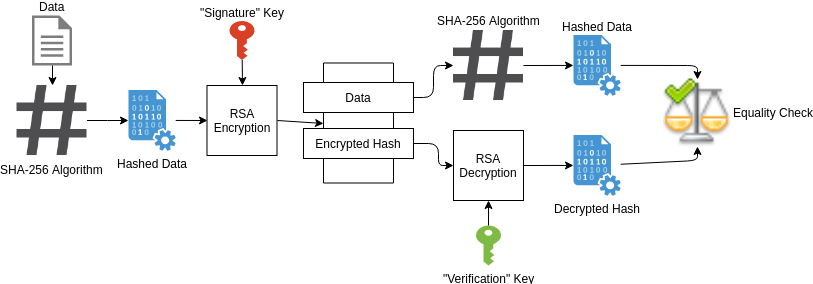

# SHIELD
## Secure, High Integrity Exchange of Light Data
*Created by John Dott, Sean Justice, Bryan Seyfert, and Andrew Kendell*

## Summary
Secure, High Integrity Exchange of Light Data (SHIELD) is a project which will provide IT with a secure alternative to WiFi by using visible light to wirelessly transfer data. SHIELD will utilize Light Emitting Diodes (LEDs) for data transfer. LEDs are able to flicker at a rate much higher than the human eye can discern. The high-speed flickering can be used to send data through digital modulation to any number of receivers in the area. This data transmission method is more secure than WiFi as light does not easily penetrate walls. Additionally, it would not interfere with any equipment or instrumentation that is sensitive to RF signals.

## High Integrity Design
SHIELD will make use of a SHA256 hash to verify data integrity.  This will allow the receiver to verify that the data it receives matches the intent of the sender. Ideally, we would implement a Digital Signature architecture to enable the receiver to verify both integrity and authenticity of data. Unfortunately, this falls a bit outside the scope and timeline of our project, and will likely not be able to be implemented in time for the University of Pittsburgh Senior Design Expo.  

## Usage
1. Ensure you have the correct packages installed through the python install tool `pip` by running the command:   
``> pip -r requirements.txt``  

2. Run the SHIELD Sender Application:  
``> python sender.py  [COM Port] [baudrate]``  

`COM Port` - The serial port over which the program will establish a connection  
`baudrate` - The desired baudrate  (**must be 115200**)  

Use your laptop's device manager to determine the correct COM Port for the connection.  The program is set to use a hardcoded filename as the transmission contents.  To edit this, simple change the line `filename = 'somefile.txt'` in `sender.py` to the desired file with relative path and save the file.  Then, run the above command.
